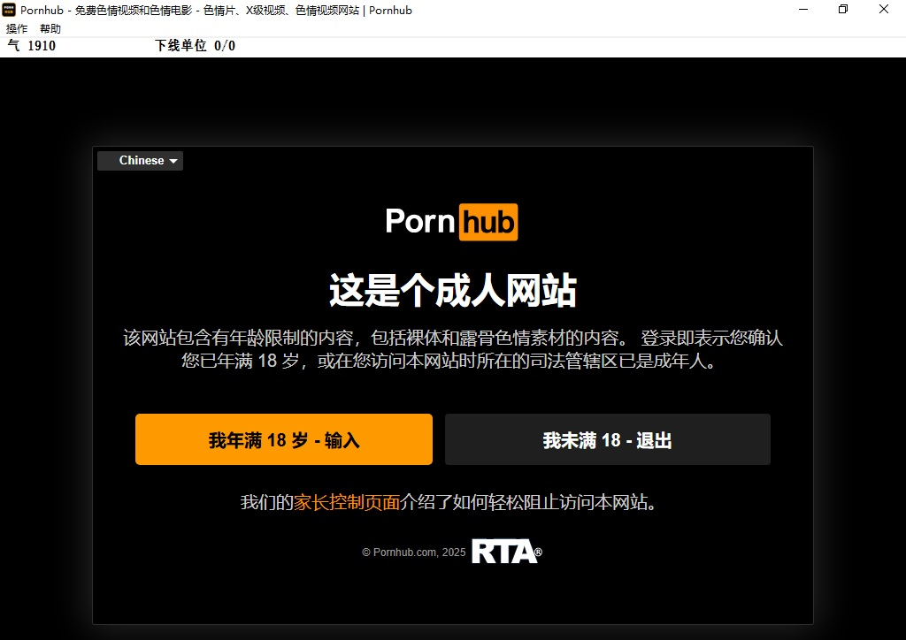

# 墙内直连P站客户端推广版下载[18岁以下不适用]

## 客户端特性
- 墙内直连，不需要使用代理服务器
- 邀请制，需要邀请码才能使用
- 推广制，鼓励用户通过生成邀请码推广给其它用户并获取使用时间

## 软件截图

## 常见问题
- **Q: 系统需求**
  - A: P站客户端下载(墙国直连版本) (系统要求: win10及以上)

- **Q: 什么是气?**
  - A: 气是可访问的剩余时长，当气不足时，会自动退出使用状态进入储气状态(隐藏主窗口,转为图标进入工具栏)，进入储气状态后不会消耗气，且会少量增加气。

- **Q: 如何增加气?**
  - A: 方法1.每个天然日都会获得一定的气; 
  -    方法2.主动进入储气状态(在线时，点击菜单"操作"-"进入储气状态" 或 直接点击窗口右上角关闭按钮)，会发现程序缩小为工具栏图标，即已进入储气状态; 
  -    方法3.介绍朋友使用,每一个使用你的邀请码的客户端在线时都会让你的客户端获得气。

- **Q: 增气的方法2和方法3有什么区别?**
  - A: 不同，方法2效率低，而且会随着剩余气量的量增加而变得更低；方法3效率较高，每个被邀请的客户端在线都可以增加定量的气。

- **Q: 为什么下线客户端运行后没有立刻显示出效果?**
  - A: 根据客户端以及P2P网络情况, 下线客户端的应用有一定延迟(几分钟到十几分钟不等)。

- **Q: 程序关闭后气会被归零?**
  - A: 是的
